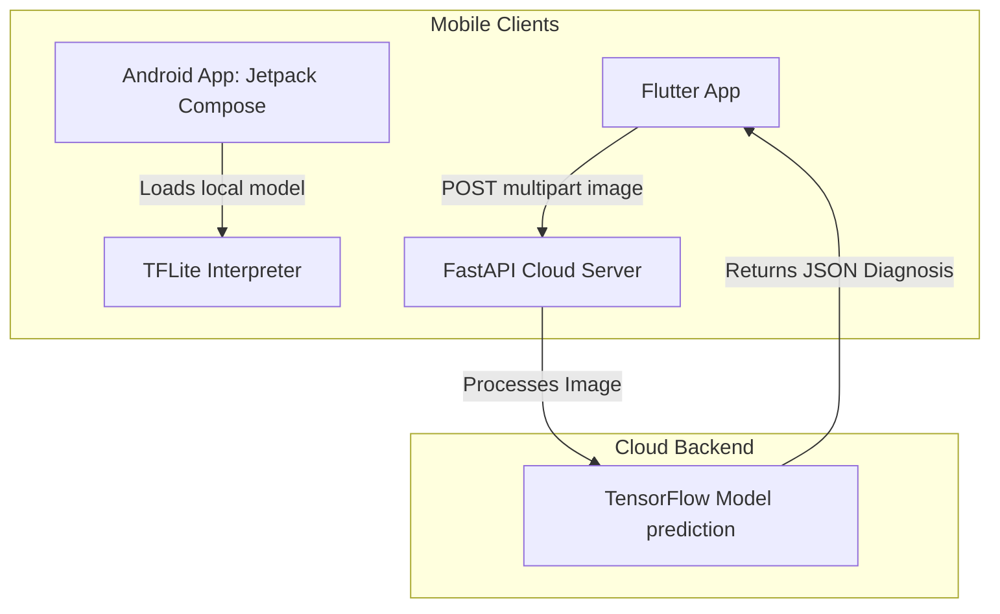

# 🌿 Plant Disease Detection & Diagnosis Platform

Welcome to the **Plant Disease Detection App** repository. This is an end-to-end mobile and cloud intelligence platform designed to help farmers, agronomists, and gardeners detect, diagnose, and treat plant diseases early. 

The repository contains a multi-module architecture:
1. **`app/`**: A native Android mobile app using Jetpack Compose and local on-device **TensorFlow Lite (TFLite)** inference.
2. **`frontend/`**: A cross-platform mobile client built with **Flutter** that interacts with the cloud backend.
3. **`backend/`**: A cloud-based API powered by **FastAPI** and **TensorFlow** for high-accuracy cloud diagnostics.

---

## 🏗️ Architecture & System Design

The system is designed to offer two modes of operation:
- **Local Inference (Offline Mode)**: The native Android app utilizes a quantized TFLite model directly on the device, allowing offline field diagnostics.
- **Cloud Inference (Online Mode)**: The Flutter cross-platform client uploads captured images to the FastAPI backend, where full-precision deep learning models diagnose the disease.



---

## 📂 Repository Structure

The core files and folders of the platform are structured as follows:

```
PlantDiseaseDetectionApp/
├── app/                      # Native Android Project
│   ├── src/main/
│   │   ├── java/com/example/plantdiseasedetectionapp/
│   │   │   ├── MainActivity.kt    # Main Compose UI, Camera/Gallery launch, TFLite inference
│   │   │   └── ResultScreen.kt    # Android UI display for prediction results
│   │   └── assets/
│   │       └── labels.txt         # Class labels for local on-device predictions
│   └── build.gradle.kts      # Android application dependencies (TFLite, Material3, Compose)
├── backend/                  # FastAPI Server
│   └── main.py               # REST API endpoints, image preprocessing, TF model loading
├── frontend/                 # Flutter Client Project
│   ├── lib/
│   │   └── main.dart         # Flutter camera selection, API request, and result navigation
│   └── pubspec.yaml          # Flutter package dependencies (image_picker, http)
└── settings.gradle.kts       # Root Gradle settings defining android app build module
```

---

## 🛠️ Modules Breakdown & Setup Instructions

### 1. Cloud Backend (`backend/`)

Powered by **FastAPI**, this backend exposes a high-performance REST endpoint for cloud diagnostics. It is set up to handle incoming image files, preprocess them, run predictions through a TensorFlow model, and return the predicted class along with a confidence score.

* **Main Entrypoint:** [main.py](file:///e:/PlantDiseaseDetectionApp/backend/main.py)

#### Setup & Launch:
1. Navigate to the `backend/` directory.
2. Create and activate a Python virtual environment:
   ```bash
   python -m venv venv
   # On Windows:
   .\venv\Scripts\activate
   # On macOS/Linux:
   source venv/bin/activate
   ```
3. Install the required dependencies:
   ```bash
   pip install fastapi uvicorn tensorflow pillow numpy python-multipart
   ```
4. Place your trained model file (`model.h5`) in the `backend/` directory and update the path in [main.py](file:///e:/PlantDiseaseDetectionApp/backend/main.py#L12) to load your model:
   ```python
   # Uncomment in main.py to enable real inference:
   model = tf.keras.models.load_model('path/to/your/model.h5')
   ```
5. Run the FastAPI development server:
   ```bash
   uvicorn main:app --host 0.0.0.0 --port 8000 --reload
   ```

---

### 2. Flutter Client (`frontend/`)

A cross-platform mobile application that provides an intuitive interface for users to take a photo using their camera or upload an existing photo from the gallery. It sends images to the FastAPI server and displays diagnosis suggestions.

* **Main Entrypoint:** [main.dart](file:///e:/PlantDiseaseDetectionApp/frontend/lib/main.dart)

#### Setup & Launch:
1. Ensure you have the Flutter SDK installed and configured.
2. Navigate to the `frontend/` directory.
3. Fetch packages:
   ```bash
   flutter pub get
   ```
4. Verify the backend IP address in [main.dart](file:///e:/PlantDiseaseDetectionApp/frontend/lib/main.dart#L53). If running on an Android Emulator, the localhost of the host machine is mapped to `10.0.2.2:8000`.
5. Run the app on a connected emulator or device:
   ```bash
   flutter run
   ```

---

### 3. Native Android App (`app/`)

A native Android project developed using **Jetpack Compose**, **Kotlin**, and **TensorFlow Lite**. It loads a `.tflite` model directly into memory and executes local image analysis, making it perfect for rural areas with poor internet connection.

* **MainActivity UI and Inference:** [MainActivity.kt](file:///e:/PlantDiseaseDetectionApp/app/src/main/java/com/example/plantdiseasedetectionapp/MainActivity.kt)
* **Results Layout:** [ResultScreen.kt](file:///e:/PlantDiseaseDetectionApp/app/src/main/java/com/example/plantdiseasedetectionapp/ResultScreen.kt)

#### Setup & Launch:
1. Open the root directory in **Android Studio**.
2. Save your trained TensorFlow Lite model (`model.tflite`) inside the assets folder: `app/src/main/assets/model.tflite`.
3. If necessary, update the [labels.txt](file:///e:/PlantDiseaseDetectionApp/app/src/main/assets/labels.txt) file to map the output indexes to the correct plant/disease category names.
4. Run/Build the application from Android Studio, or execute the following gradle wrapper command:
   ```bash
   ./gradlew assembleDebug
   ```

---

## 🌿 Supported Plant Diseases & Classes

The system currently supports classifying the following potato and tomato leaves conditions locally (as specified in [labels.txt](file:///e:/PlantDiseaseDetectionApp/app/src/main/assets/labels.txt)):

* 🥔 **Potato**
  * Early blight
  * Late blight
  * Healthy
* 🍅 **Tomato**
  * Bacterial spot
  * Early blight
  * Late blight
  * Leaf Mold
  * Septoria leaf spot
  * Spider mites (Two-spotted spider mite)
  * Target Spot
  * Tomato Yellow Leaf Curl Virus
  * Tomato mosaic virus
  * Healthy

*Note: The FastAPI backend contains an extended mock list of supported classes (including Apple, Corn, and Grape varieties).*

---

## 🔮 Future Roadmap
- [ ] Connect the Flutter and Android apps to a SQLite database/Hive to persist the diagnosis history locally.
- [ ] Incorporate offline information cards on treatment methods and symptoms for each plant disease.
- [ ] Implement cloud sync to back up history lists across user devices.
